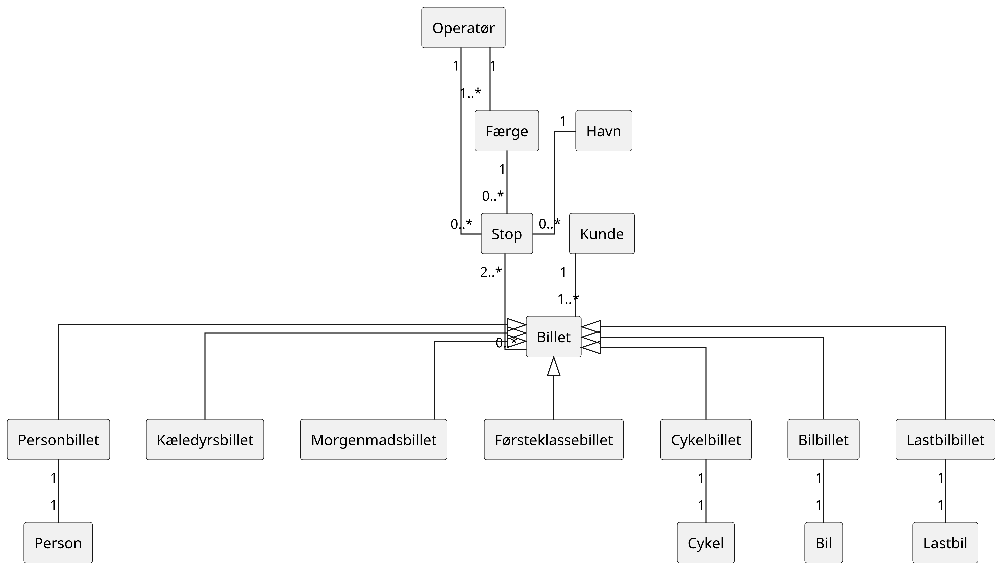
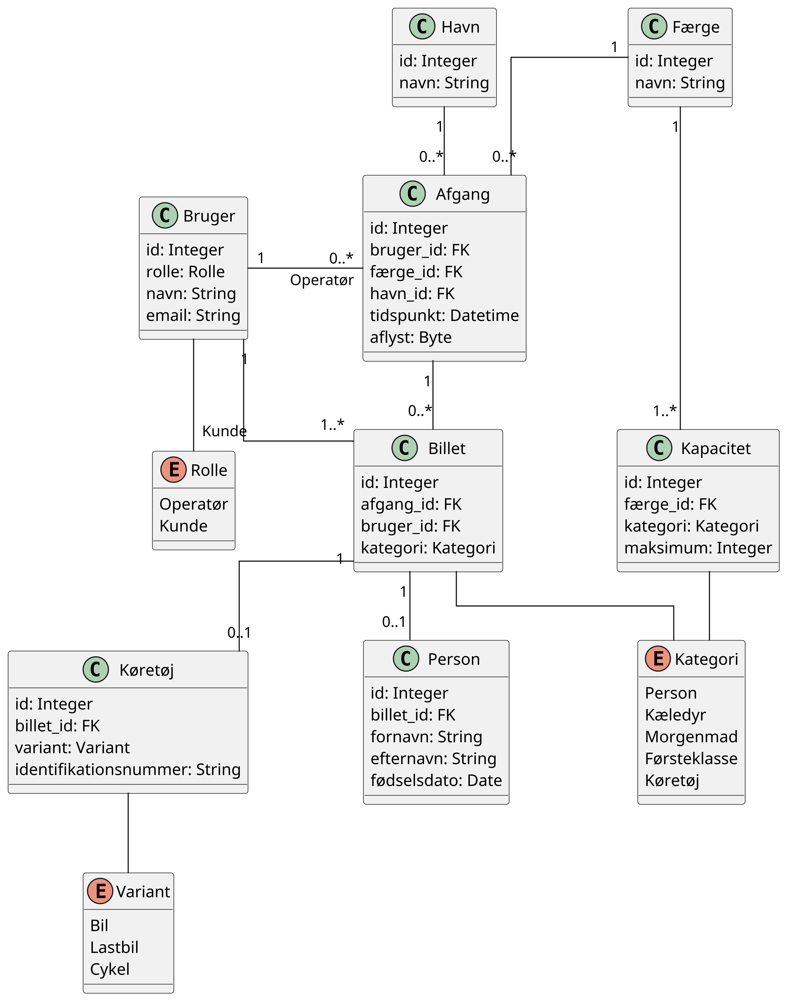
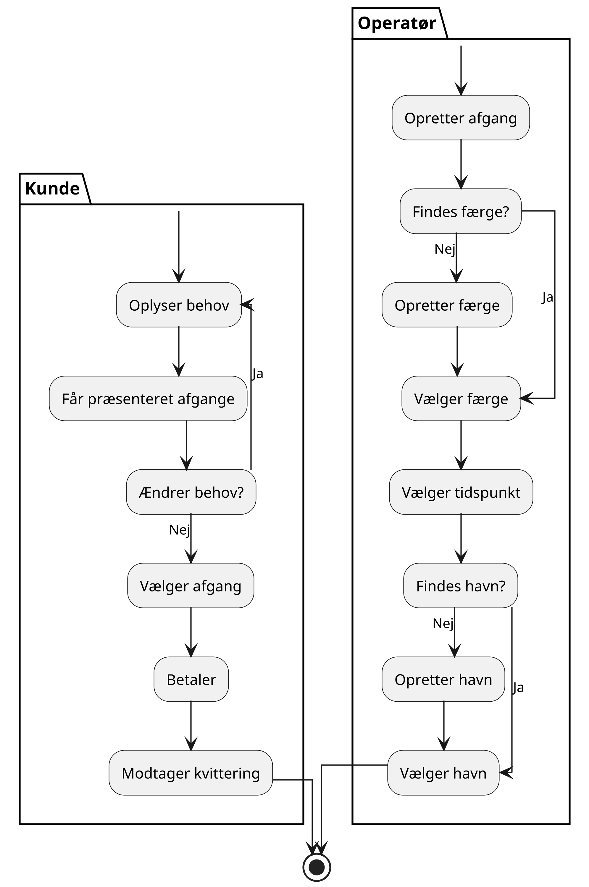
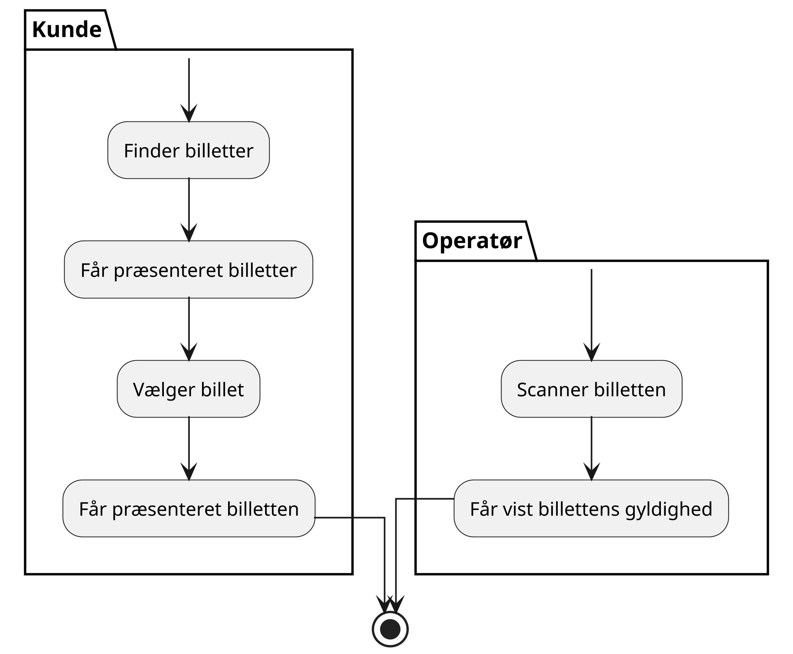
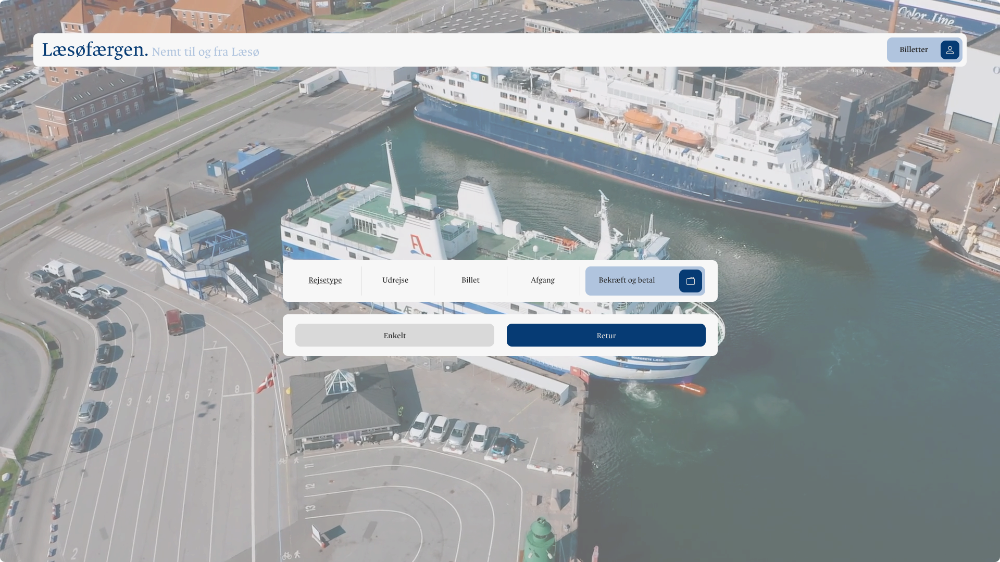
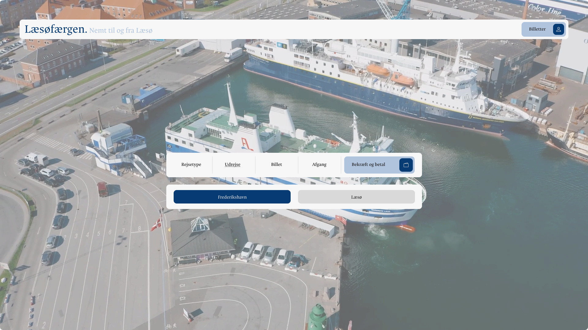
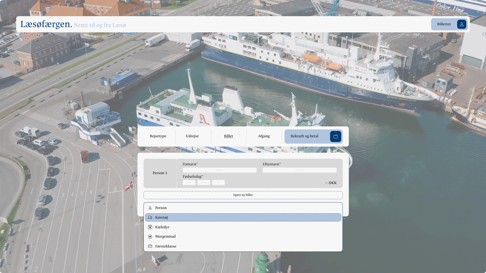
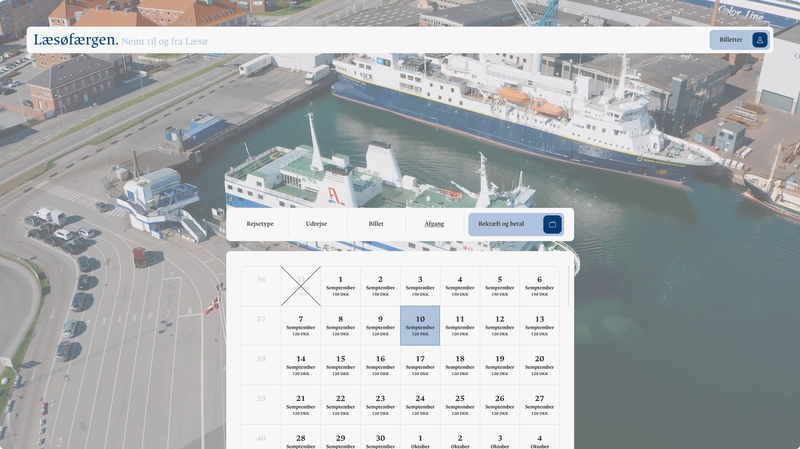
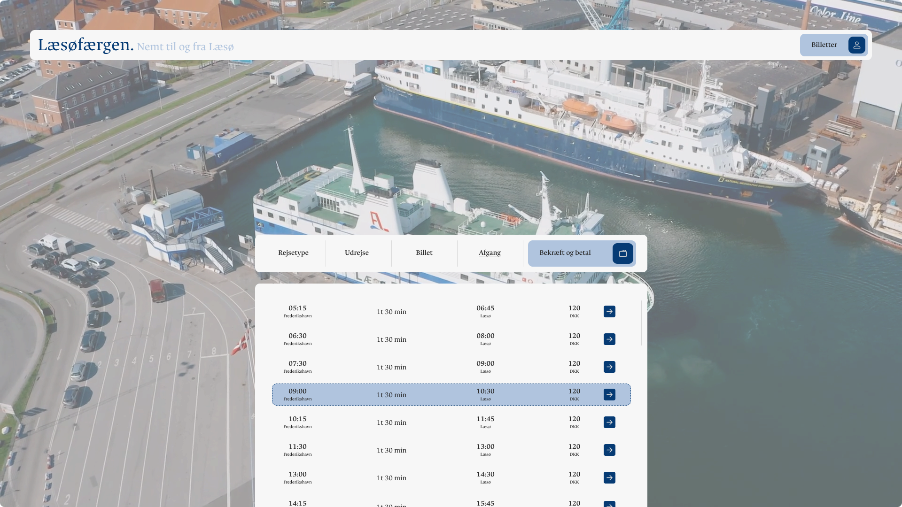
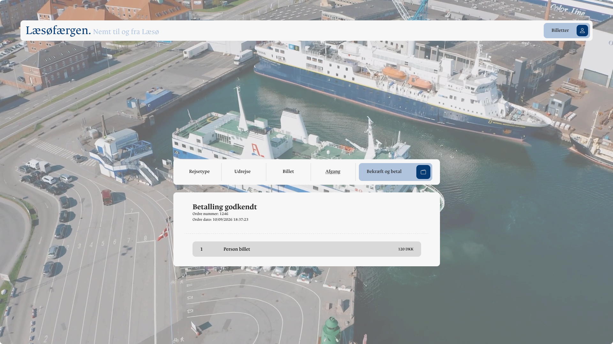

# Svendeprøven

## Casebeskrivelse

Analog billethåndtering kan være en omfattende opgave, da det kan skabe en flaskehals ved billetlugen
i forbindelse med køb og udlevering af billetter. Muligheden for tilkøb er begrænset, da kunden skal
tage stilling på stedet.

## Problemformulering

Hvordan kan der udvikles et sikkert billethåndteringssystem, som giver kunden mulighed for at købe
billetter og overveje relevante tilkøb inden ankomst?

## Brugerhistorier

1. Som kunde ønsker jeg at kunne købe billetter inden ankomst, så jeg undgår kø ved billetlugen.
2. Som kunde ønsker jeg at kunne betale online, så købet kan gennemføres hjemmefra.
3. Som kunde ønsker jeg at modtage mine billetter digitalt, så jeg nemt kan fremvise dem ved ankomst.
4. Som kunde ønsker jeg at blive notificeret ved aflysninger eller ændringer i afgangstidspunktet.

5. Som operatør ønsker jeg at kunne oprette og administrere afgange, så kunderne kan købe billetter til dem.
6. Som operatør ønsker jeg at kunne administrere færger og deres kapacitet, så der ikke sælges flere billetter end færgen kan håndtere.
7. Som operatør ønsker jeg at kunne validere billetter, så jeg kan kontrollere dem ved kundens ankomst.

## Analyse

1. **Hvad er formålet med et billethåndteringssystem?**
  Formålet er at fjerne flaskehalsen ved billetlugen ved at digitalisere køb og validering af billetter.

2. **Hvilke undersystemer indeholder systemet?**
  Brugerhåndtering, reservation og validering.

3. **Hvad er den generaliserede betegnelse for systemet?**
  Adgangsbevis.

4. **Hvilke primitiver indeholder det generaliserede system?**
  Dokumentation for adgang.

5. **Hvordan er primitiverne struktureret?**
  Som en liste.

### Navneord

* Kunde
* Billet
* Ankomst
* Kø
* Billetluge
* Køb
* Afgang
* Afgangstidspunkt
* Operatør
* Færge
* Kapacitet

### Udsagnsord

* Købe
* Undgå
* Betale
* Gennemføre
* Modtage
* Fremvise
* Notificere
* Oprette
* Administrere
* Sælge
* Håndtere
* Validere
* Kontrollere

### Domænemodel

## Design

### Elementer

* Konfigurationsstyring
  - Eleven skal benytte en konfigurations styringsløsning til versions- og
    konfigurationsstyring under udarbejdelse af sit produkt.

* Sikkerhed
  - Eleven skal inddrage sikkerhed i sit arbejde med produktet.

* Test
  - Eleven skal inkorporere hvordan kvaliteten af produktet sikres,
    herunder hvordan produktet kan testes.

* Database
  - Alle produkter skal indeholde mindst én database til lagring/behandling af data.
    Typisk vil der være tale om relationelle databaser, men andre database typer kan,
    afhængig af projektets karakter, også komme i spil.

* Server
  - Alle produkter skal indeholde en server. Og alle jeres Web baserede produkter både Clientside og
    Serverside skal hostes på en måde, så de kan tilgås af lærere og censor,
    uden a disse skal være koblet på skolens netværk.

* Klient/Server
  - En web applikation og/eller en standalone applikation,
    der tilgår data fra en server via et kendt API som f.eks REST.
    Applikationen kan være distribueret eller cloudbaseret.

* CI/CD
  - Det er også muligt at involvere Continuous Integration og Continuous Deployment,
    hvis man synes det er relevant for projektet. Her kan man med fordel lave automatiserede modul- og
    integrationstest af ens system/systemer, når man laver en Push til f.eks. GitHub.
    Dette kan man med fordel lave et eksempel på under sin fremlæggelse. Det vil sige,
    man laver en push af sit projekt/sine projekter, går videre med et andet punkt i sin fremlæggelse.
    Og mens man er i gang med dette andet punkt,
    modtager man en mail fra (f.eks.) GitHub med resultatet af build og test run.

### Datamodel

### Klient

1. Præsentation: Vis data til brugeren.
2. Indsamling: Registrér brugerinteraktioner til videre behandling.
3. Udveksling: Håndtér datakommunikation med serveren via API'et.

### Server

1. Præsentation: Eksponér API'et for klienten.
2. Validering: Kontrollér indgående data for at forhindre sikkerhedssårbarheder såsom SQL-injektion.
3. Lagring: Gem data i databasen.

### API

API-specifikationen findes i [`openapi.yml`](documentation/openapi.yaml).

## Brugeroplevelse

### Brugerflow

#### Reservation

#### Validering

### Grænseflade

#### Typografi

* Skrifttype: Alyamama
* Grundstørrelse: 16px
* Skala: Major Third (1.250)
* Skriftvægt: 400
* Linjehøjde: 1.6

| Type    | Størrelse  |
| ------- | ---------- |
| h1      | `3.815rem` |
| h2      | `3.052rem` |
| h3      | `2.441rem` |
| h4      | `1.953rem` |
| h5      | `1.563rem` |
| h6      | `1.25rem`  |
| p       | `1rem`     |
| small   | `0.8rem`   |
| x-small | `0.64rem`  |

#### Tema

| Type     | Farve     | Beskrivelse                 |
| -------- | --------- | --------------------------- |
| Tekst    | `#292929` | Meget mørk grå, næsten sort |
| Baggrund | `#f7f7f7` | Meget lys grå, næsten hvid  |
| Primær   | `#063b74` | Dyb, mørk marineblå         |
| Sekundær | `#d9d9d9` | Lys neutral grå             |
| Accent   | `#b0c4de` | Lys, afdæmpet stålblå       |

#### Skitse

