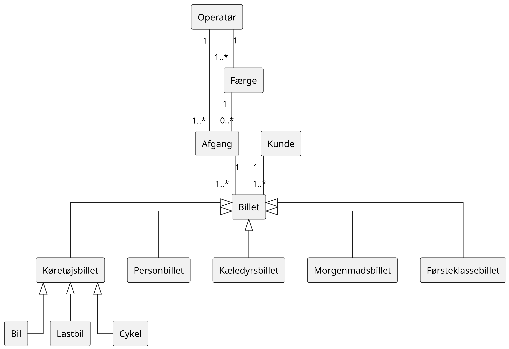
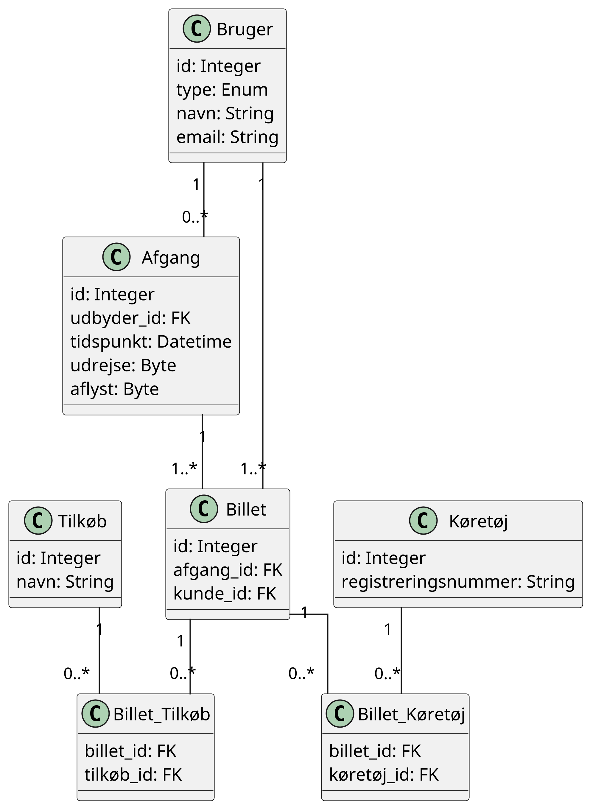

# Svendeprøven

## Casebeskrivelse

Analog billethåndtering kan være en omfattende opgave, da det kan skabe en flaskehals ved billetlugen
i forbindelse med køb og udlevering af billetter. Muligheden for tilkøb er begrænset, da kunden skal
tage stilling på stedet.

## Problemformulering

Hvordan kan der udvikles et sikkert billethåndteringssystem, som giver kunden mulighed for at købe
billetter og overveje relevante tilkøb inden ankomst?

## Brugerhistorier

1. Som kunde ønsker jeg at kunne købe en billet inden ankomst, så jeg undgår kø ved billetlugen.
2. Som kunde ønsker jeg at kunne vælge tilkøb, så jeg kan planlægge mit besøg på forhånd.
3. Som kunde ønsker jeg at kunne betale online, så købet kan gennemføres hjemmefra.
4. Som kunde ønsker jeg at modtage min billet digitalt, så jeg nemt kan fremvise den ved ankomst.

6. Som udbyder ønsker jeg at kunne oprette billetter, så kunderne kan købe dem online.
7. Som udbyder ønsker jeg at kunne oprette tilkøb, så kunderne kan købe ekstra produkter eller ydelser.
8. Som udbyder ønsker jeg at kunne validere billetter, så jeg kan kontrollere dem ved kundens ankomst.

## Analyse

1. **Hvad er formålet med et billethåndteringssystem?**
  Formålet er at fjerne flaskehalsen ved billetlugen ved at digitalisere køb og validering af billetter.

2. **Hvilke undersystemer indeholder systemet?**
  Brugerhåndtering, Booking og validering.

3. **Hvad er den generaliserede betegnelse for systemet?**
  Adgangsbevis.

4. **Hvilke primitiver indeholder det generaliserede system?**
  Dokumentation for adgang.

5. **Hvordan er primitiverne struktureret?**
  Som en liste.

### Navneord

* Kunde
* Udbyder
* Billet
* Ankomst
* Kø
* Billetluge
* Tilkøb
* Besøg
* Køb
* Produkt
* Ydelse

### Udsagnsord

* Købe
* Undgå
* Vælge
* Planlægge
* Betale
* Gennemføre
* Modtage
* Fremvise
* Oprette
* Validere
* Kontrollere

### Domænemodel

## Design

### Datamodel

### Klient

1. Præsentation: Vis data til brugeren.
2. Indsamling: Registrér brugerinteraktioner til videre behandling.
3. Udveksling: Håndtér datakommunikation med serveren via API'et.

### Server

1. Præsentation: Eksponér API'et for klienten.
2. Validering: Kontrollér indgående data for at forhindre sikkerhedssårbarheder såsom SQL-injektion.
3. Lagring: Gem data i databasen.

### API

| **Slutpunkt**       | **Handling** | **Beskrivelse**                                       | **Parameter**         | **Type** | **Detaljer**                                              |
|---------------------|--------------|-------------------------------------------------------|-----------------------|----------|-----------------------------------------------------------|
| brugere             | Opret        | Opret en ny bruger.                                   | `type`                | enum     | Brugerens type, som kan være udbyder eller kunde.         |
|                     |              |                                                       | `navn`                | string   | Brugerens navn.                                           |
|                     |              |                                                       | `email`               | string   | Brugerens e-mailadresse.                                  |
|                     | Læs          | Hent en bruger.                                       | `id`                  | integer  | Unikt ID på brugeren.                                     |
|                     | Opdater      | Opdater en eksisterende bruger.                       | `id`                  | integer  | Unikt ID på brugeren, der skal opdateres.                 |
|                     |              |                                                       | `navn`                | string   | Brugerens navn.                                           |
| afgange             | Opret        | Opret en ny afgang.                                   | `udbyder_id`          | integer  | Unikt ID på udbyderen.                                    |
|                     |              |                                                       | `tidspunkt`           | datetime | Tidspunktet hvor båden lægger fra land (ISO 8601-format). |
|                     |              |                                                       | `udrejse`             | byte     | Angiver hvor båden sejler fra.                            |
|                     | Læs          | Hent en liste over afgange med valgfri sideinddeling. | `antal`               | integer  | Maksimalt antal afgange, der returneres.                  |
|                     | Opdater      | Opdater en eksisterende afgang.                       | `id`                  | integer  | Unikt ID på afgangen, der skal opdateres.                 |
|                     |              |                                                       | `tidspunkt`           | datetime | Tidspunktet hvor båden lægger fra land (ISO 8601-format). |
|                     |              |                                                       | `udrejse`             | byte     | Angiver hvor båden sejler fra.                            |
|                     |              |                                                       | `aflyst`              | byte     | Angiver om afgangen er aflyst.                            |
| billetter           | Opret        | Opret en ny billet.                                   | `afgang_id`           | integer  | Unikt ID på afgangen.                                     |
|                     | Læs          | Hent en billet.                                       | `id`                  | integer  | Unikt ID på billetten.                                    |
|                     | Opdater      | Tilknyt en kunde til en billet.                       | `id`                  | integer  | Unikt ID på billetten.                                    |
|                     |              |                                                       | `kunde_id`            | integer  | Unikt ID på kunden.                                       |
| tilkøb              | Opret        | Opret et nyt tilkøb.                                  | `navn`                | string   | Navn på tilkøbet.                                         |
|                     | Læs          | Hent en liste over tilkøb.                            | `antal`               | integer  | Maksimalt antal tilkøb, der returneres.                   |
| køretøjer           | Opret        | Opret et nyt køretøj.                                 | `registreringsnummer` | string   | Køretøjets registreringsnummer.                           |
|                     | Læs          | Hent et køretøj.                                      | `id`                  | integer  | Unikt ID på køretøjet.                                    |
| billetter/tilkøb    | Opret        | Tilknyt et tilkøb til en billet.                      | `tilkøb_id`           | integer  | Unikt ID på tilkøbet, der skal tilknyttes.                |
|                     |              |                                                       | `billet_id`           | integer  | Unikt ID på billetten.                                    |
|                     | Læs          | Hent alle tilkøb tilknyttet en billet.                | `billet_id`           | integer  | Unikt ID på billetten.                                    |
| billetter/køretøjer | Opret        | Tilknyt et køretøj til en billet.                     | `køretøj_id`          | integer  | Unikt ID på køretøjet, der skal tilknyttes.               |
|                     |              |                                                       | `billet_id`           | integer  | Unikt ID på billetten.                                    |
|                     | Læs          | Hent alle køretøjer tilknyttet en billet.             | `billet_id`           | integer  | Unikt ID på billetten.                                    |
