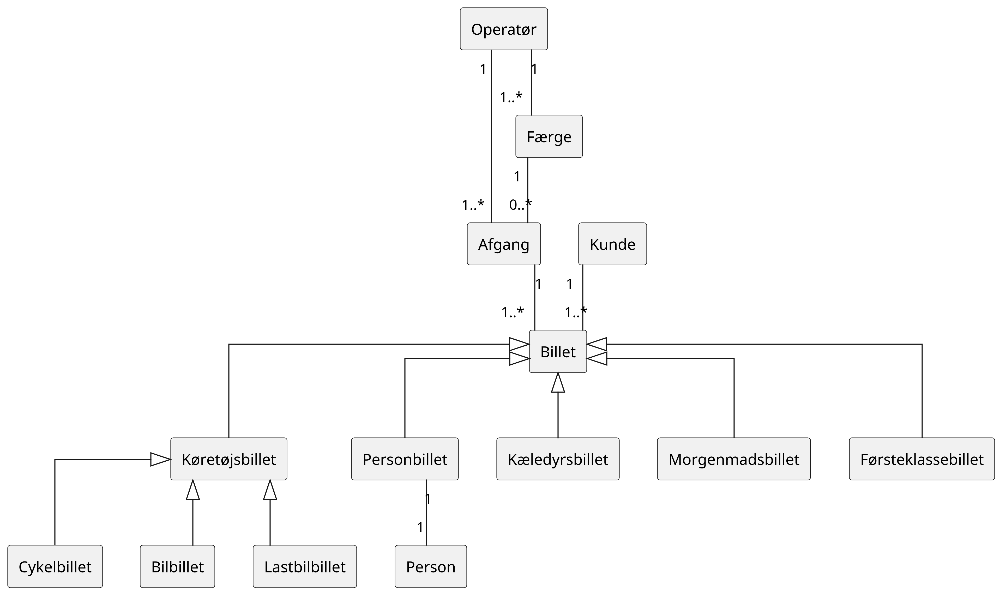
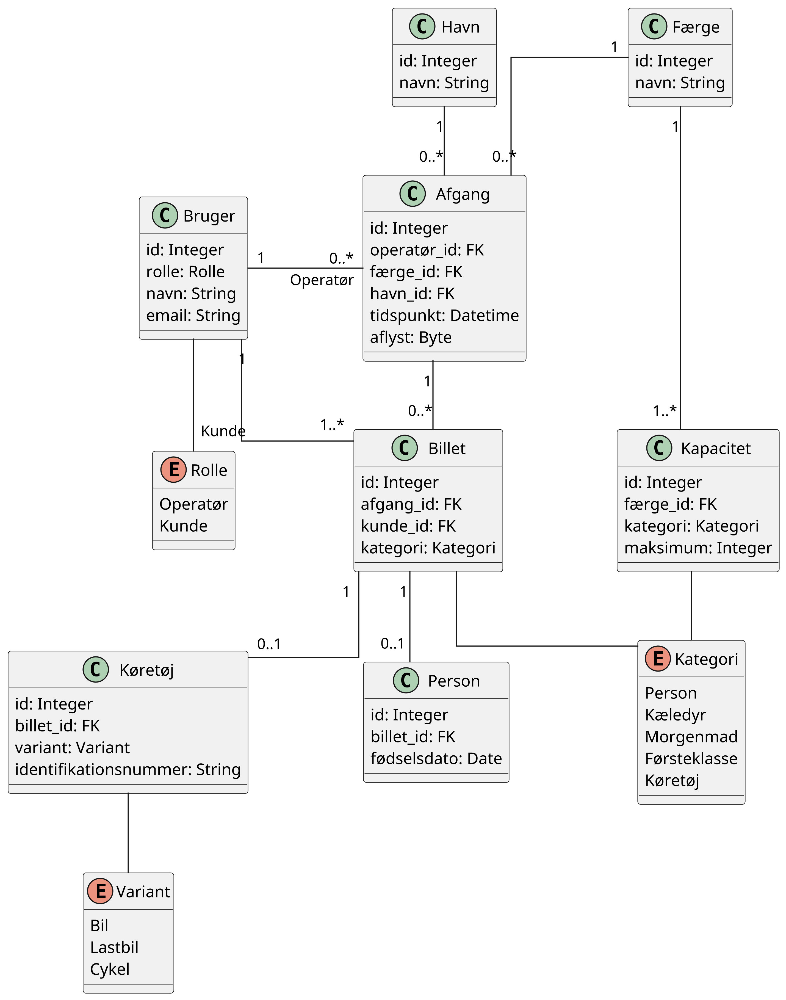
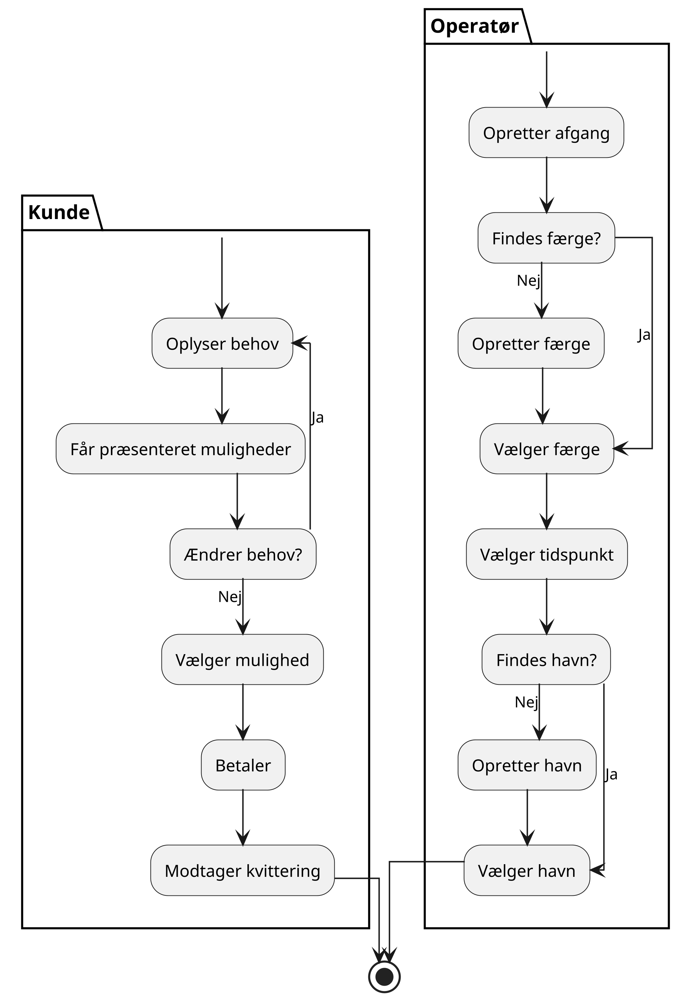

# Svendeprøven

## Casebeskrivelse

Analog billethåndtering kan være en omfattende opgave, da det kan skabe en flaskehals ved billetlugen
i forbindelse med køb og udlevering af billetter. Muligheden for tilkøb er begrænset, da kunden skal
tage stilling på stedet.

## Problemformulering

Hvordan kan der udvikles et sikkert billethåndteringssystem, som giver kunden mulighed for at købe
billetter og overveje relevante tilkøb inden ankomst?

## Brugerhistorier

1. Som kunde ønsker jeg at kunne købe billetter inden ankomst, så jeg undgår kø ved billetlugen.
2. Som kunde ønsker jeg at kunne betale online, så købet kan gennemføres hjemmefra.
3. Som kunde ønsker jeg at modtage mine billetter digitalt, så jeg nemt kan fremvise dem ved ankomst.
4. Som kunde ønsker jeg at blive notificeret ved aflysninger eller ændringer i afgangstidspunktet.

5. Som operatør ønsker jeg at kunne oprette og administrere afgange, så kunderne kan købe billetter til dem.
6. Som operatør ønsker jeg at kunne administrere færger og deres kapacitet, så der ikke sælges flere billetter end færgen kan håndtere.
7. Som operatør ønsker jeg at kunne validere billetter, så jeg kan kontrollere dem ved kundens ankomst.

## Analyse

1. **Hvad er formålet med et billethåndteringssystem?**
  Formålet er at fjerne flaskehalsen ved billetlugen ved at digitalisere køb og validering af billetter.

2. **Hvilke undersystemer indeholder systemet?**
  Brugerhåndtering, reservation og validering.

3. **Hvad er den generaliserede betegnelse for systemet?**
  Adgangsbevis.

4. **Hvilke primitiver indeholder det generaliserede system?**
  Dokumentation for adgang.

5. **Hvordan er primitiverne struktureret?**
  Som en liste.

### Navneord

* Kunde
* Billet
* Ankomst
* Kø
* Billetluge
* Køb
* Afgang
* Afgangstidspunkt
* Operatør
* Færge
* Kapacitet

### Udsagnsord

* Købe
* Undgå
* Betale
* Gennemføre
* Modtage
* Fremvise
* Notificere
* Oprette
* Administrere
* Sælge
* Håndtere
* Validere
* Kontrollere

### Domænemodel

## Design

### Datamodel

### Klient

1. Præsentation: Vis data til brugeren.
2. Indsamling: Registrér brugerinteraktioner til videre behandling.
3. Udveksling: Håndtér datakommunikation med serveren via API'et.

### Server

1. Præsentation: Eksponér API'et for klienten.
2. Validering: Kontrollér indgående data for at forhindre sikkerhedssårbarheder såsom SQL-injektion.
3. Lagring: Gem data i databasen.

### API

| **Slutpunkt** | **Handling** | **Beskrivelse**                                | **Parameter**           | **Type** | **Detaljer**                                                                      |
|---------------|--------------|------------------------------------------------|-------------------------|----------|-----------------------------------------------------------------------------------|
| brugere       | Opret        | Opret en ny bruger.                            | `rolle`                 | enum     | Brugerens rolle: `Operatør` eller `Kunde`.                                        |
|               |              |                                                | `navn`                  | string   | Brugerens navn.                                                                   |
|               |              |                                                | `email`                 | string   | Brugerens e-mailadresse.                                                          |
|               | Læs          | Hent en bruger.                                | `id`                    | integer  | Unikt ID på brugeren.                                                             |
|               | Opdater      | Opdater en eksisterende bruger.                | `id`                    | integer  | Unikt ID på brugeren.                                                             |
|               |              |                                                | `rolle`                 | enum     | Brugerens rolle: `Operatør` eller `Kunde`.                                        |
|               |              |                                                | `navn`                  | string   | Brugerens navn.                                                                   |
| færger        | Opret        | Opret en ny færge.                             | `navn`                  | string   | Færgens navn.                                                                     |
|               | Læs          | Hent en liste over færger.                     | `antal`                 | integer  | Maksimalt antal færger, der returneres.                                           |
|               | Læs          | Hent en færge.                                 | `id`                    | integer  | Unikt ID på færgen.                                                               |
|               | Opdater      | Opdater en eksisterende færge.                 | `id`                    | integer  | Unikt ID på færgen.                                                               |
|               |              |                                                | `navn`                  | string   | Færgens navn.                                                                     |
| havne         | Opret        | Opret en ny havn.                              | `navn`                  | string   | Havnens navn.                                                                     |
|               | Læs          | Hent en liste over havne.                      | `antal`                 | integer  | Maksimalt antal havne, der returneres.                                            |
|               | Læs          | Hent en havn.                                  | `id`                    | integer  | Unikt ID på havnen.                                                               |
|               | Opdater      | Opdater en eksisterende havn.                  | `id`                    | integer  | Unikt ID på havnen.                                                               |
|               |              |                                                | `navn`                  | string   | Havnens navn.                                                                     |
| kapaciteter   | Opret        | Opret en kapacitetsbegrænsning for en færge.   | `færge_id`              | integer  | Unikt ID på færgen.                                                               |
|               |              |                                                | `kategori`              | enum     | Kategorien: `Person`, `Kæledyr`, `Morgenmad`, `Førsteklasse` eller `Køretøj`.     |
|               |              |                                                | `maksimum`              | integer  | Færgens maksimale kapacitet for kategorien.                                       |
|               | Læs          | Hent kapacitetsbegrænsninger for en færge.     | `færge_id`              | integer  | Unikt ID på færgen.                                                               |
|               | Opdater      | Opdater en eksisterende kapacitetsbegrænsning. | `id`                    | integer  | Unikt ID på kapacitetsbegrænsningen.                                              |
|               |              |                                                | `kategori`              | enum     | Kategorien: `Person`, `Kæledyr`, `Morgenmad`, `Førsteklasse` eller `Køretøj`.     |
|               |              |                                                | `maksimum`              | integer  | Færgens maksimale kapacitet for kategorien.                                       |
| afgange       | Opret        | Opret en ny afgang.                            | `operatør_id`           | integer  | Unikt ID på operatøren.                                                           |
|               |              |                                                | `færge_id`              | integer  | Unikt ID på færgen.                                                               |
|               |              |                                                | `udrejse`               | enum     | Udrejse: `Frederikshavn` eller `Læsø`.                                            |
|               |              |                                                | `tidspunkt`             | datetime | Tidspunktet for afgang i ISO 8601-format.                                         |
|               |              |                                                | `aflyst`                | boolean  | Angiver, om afgangen er aflyst.                                                   |
|               | Læs          | Hent en liste over afgange.                    | `antal`                 | integer  | Maksimalt antal afgange, der returneres.                                          |
|               | Opdater      | Opdater en eksisterende afgang.                | `id`                    | integer  | Unikt ID på afgangen.                                                             |
|               |              |                                                | `færge_id`              | integer  | Unikt ID på færgen.                                                               |
|               |              |                                                | `udrejse`               | enum     | Udrejse: `Frederikshavn` eller `Læsø`.                                            |
|               |              |                                                | `tidspunkt`             | datetime | Tidspunktet for afgang i ISO 8601-format.                                         |
|               |              |                                                | `aflyst`                | boolean  | Angiver, om afgangen er aflyst.                                                   |
| billetter     | Opret        | Opret en ny billet.                            | `afgang_id`             | integer  | Unikt ID på afgangen.                                                             |
|               |              |                                                | `kunde_id`              | integer  | Unikt ID på kunden.                                                               |
|               |              |                                                | `kategori`              | enum     | Billetkategori: `Person`, `Kæledyr`, `Morgenmad`, `Førsteklasse` eller `Køretøj`. |
|               | Læs          | Hent billetter til en kunde.                   | `kunde_id`              | integer  | Unikt ID på kunden.                                                               |
| personer      | Opret        | Opret en person til en billet.                 | `billet_id`             | integer  | Unikt ID på personens billet.                                                     |
|               |              |                                                | `fødselsdato`           | date     | Personens fødselsdato i ISO 8601-format.                                          |
|               | Opdater      | Opdater en eksisterende person.                | `id`                    | integer  | Unikt ID på personen.                                                             |
|               |              |                                                | `fødselsdato`           | date     | Personens fødselsdato i ISO 8601-format.                                          |
| køretøjer     | Opret        | Opret et køretøj til en billet.                | `billet_id`             | integer  | Unikt ID på køretøjets billet.                                                    |
|               |              |                                                | `variant`               | enum     | Køretøjets variant: `Bil`, `Lastbil` eller `Cykel`.                               |
|               |              |                                                | `identifikationsnummer` | string   | Køretøjets identifikationsnummer.                                                 |
|               | Opdater      | Opdater et eksisterende køretøj.               | `id`                    | integer  | Unikt ID på køretøjet.                                                            |
|               |              |                                                | `variant`               | enum     | Køretøjets variant: `Bil`, `Lastbil` eller `Cykel`.                               |

## Brugeroplevelse

### Brugerflow

#### Reservation

#### Validering

### Grænseflade

#### Typografi

* Skrifttype: Alyamama
* Grundstørrelse: 16px
* Skala: Major Third (1.250)
* Skriftvægt: 400
* Linjehøjde: 1.6

| Type    | Størrelse  |
| ------- | ---------- |
| h1      | `3.815rem` |
| h2      | `3.052rem` |
| h3      | `2.441rem` |
| h4      | `1.953rem` |
| h5      | `1.563rem` |
| h6      | `1.25rem`  |
| p       | `1rem`     |
| small   | `0.8rem`   |
| x-small | `0.64rem`  |

#### Lyst tema

| Type     | Farve     | Beskrivelse                 |
| -------- | --------- | --------------------------- |
| Tekst    | `#292929` | Meget mørk grå, næsten sort |
| Baggrund | `#f7f7f7` | Meget lys grå, næsten hvid  |
| Primær   | `#063b74` | Dyb, mørk marineblå         |
| Sekundær | `#d9d9d9` | Lys neutral grå             |
| Accent   | `#b0c4de` | Lys, afdæmpet stålblå       |

#### Mørkt tema

| Type     | Farve     | Beskrivelse                 |
| -------- | --------- | --------------------------- |
| Tekst    | `#d6d6d6` | Lys neutral grå             |
| Baggrund | `#080808` | Meget mørk grå, næsten sort |
| Primær   | `#8bc0f9` | Lys, klar blå               |
| Sekundær | `#262626` | Mørk neutral grå            |
| Accent   | `#21354f` | Mørk, afdæmpet stålblå      |